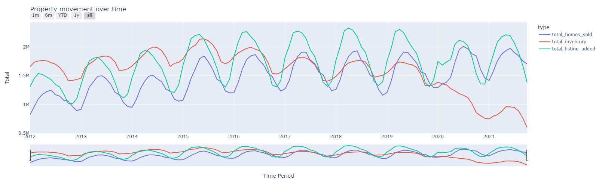

# Real Estate Market Analysis with PySpark and Plotly

**Introduction**

This project explores real estate market trends and performance using PySpark for big data processing and Plotly for interactive data visualization. By utilizing the power of PySpark, we handle large datasets efficiently, and Plotly enables us to create rich, interactive visualizations that allow us to gain insights at a glance.

**Technologies Used**

- *PySpark*: PySpark is a powerful Python library for big data processing, specifically designed for fast, scalable, and distributed computing on large datasets.

- *Plotly*: Plotly is a Python graphing library that provides interactive and web-based visualizations for data analysis. It supports a wide range of plot types, including line plots, scatter plots, and histograms.

**Key Analysis Steps**

1. *Data Cleaning and Filtering:* We begin by cleaning and filtering the dataset to remove any null values and columns that do not provide valuable insights for our analysis.

2. *Outlier Detection and Removal:* We detect and remove outliers that can skew our analysis. Using PySpark functions, we identify and remove data points that fall outside the 1.5 times interquartile range (IQR).

3. *Data Aggregation and Calculation:* We aggregate and calculate various key statistics such as average, total, and weighted average for important variables like median sale price, median list price, and number of homes sold.

4. *Visualization with Plotly:* We create interactive visualizations using Plotly, which allows us to explore and analyze the data with ease. We create line plots, scatter plots, and bar plots to visualize trends and distributions over time and across different geographic regions.

6. *Geographic Analysis:* We use Plotly's geographic plotting capabilities to visualize the distribution of homes sold and time on the market across different states.

**Summary of Findings**

1. *Trend Analysis:* The trends of median sale price and median list price indicate fluctuations over time, which may suggest market dynamics and changing demand.

2. *Seasonality Effects:* There are observable seasonal trends in the number of homes sold, inventory, and new listings, which can help us understand market cycles.

3. *Property-Wise Sale Price Distribution:* We explore how different property types vary in terms of median sale price and median list price over time.

4. *State-Wise Distribution:* We observe how the number of homes sold and time on the market vary across different states, providing insights into regional market conditions.

**Conclusion**

Through this project, we demonstrate the power of PySpark for handling big data and Plotly for creating interactive visualizations. We've gained insights into real estate market trends, seasonal effects, and regional dynamics, all of which are valuable for making informed decisions in the real estate market.
